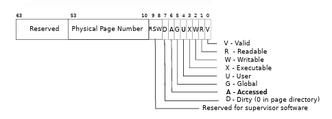

**PTE_V**：PTE是否有效
**PTE_R**：是否允许读取
**PTE_W**：是否允许写入操作
**PTE_X**：是否允许执行操作，如果设置为1，则允许执行页面的代码
**PTE_U**：是否允许用户态访问
**PTE_G**：表示全局页面
**PTE_A**：当一个页面被读取或写入时，硬件会将A标志位设为1
**PTE_D**：脏页，当一个页面被写入，硬件会将D标志设为1。

##Lab: Copy-on-Write Fork for xv6

&emsp;COW fork()（写时复制fork()）仅为子进程创建一个页表，其中包含指向父进程物理页面的用户内存页表项（PTE）。COW fork()将父进程和子进程中的所有用户PTE标记为只读。当任一进程尝试写入这些COW页面时，CPU会强制引发一个页面错误。内核的页面错误处理程序检测到此情况，为引发错误的进程分配一个物理内存页面，将原始页面复制到新页面中，并修改引发错误进程中相关的PTE，这次将PTE标记为可写。当页面错误处理程序返回时，用户进程将能够写入其页面的副本。<br>
&emsp;写时复制使得释放用户内存的物理页面变得复杂，因为一个页面可能有许多进程的页表所应用，只有当最后一个引用消失时，你才应该释放他

目标：**完成COW fork()**
&emsp;1.修改uvmcopy()函数，将父进程的物理页面映射到子进程中，而不是分配新的页面。对于具有PTE_W标志的页面，清除子进程和父进程的PTE中的PTE_W标志。
```c
int
uvmcopy(pagetable_t old, pagetable_t new, uint64 sz)
{
  pte_t *pte;
  uint64 pa, i;
  uint flags;
  char *mem;
  for(i = 0; i < sz; i += PGSIZE){
    if((pte = walk(old, i, 0)) == 0)
      panic("uvmcopy: pte should exist");
    if((*pte & PTE_V) == 0)
      panic("uvmcopy: page not present");
     pa = PTE2PA(*pte);
    //设置父进程PTE_W标志
    *pte = *pte & (0xFFFFFFFFFFFFFEFB);
    //获得页表项标志位
    flags = PTE_FLAGS(*pte);
    //设置子进程W标志位
    flags = flags & (0xFFFFFFFFFFFFFEFB);
    //创建子进程到父进程内存的映射
    if(mappages(newm, i, PGSIZE, (uint64)pa,flags) != 0){
      goto err;
    }   
  }
  return 0;
 err:
  uvmunmap(new, 0, i / PGSIZE, 1);
  return -1;
}
```
