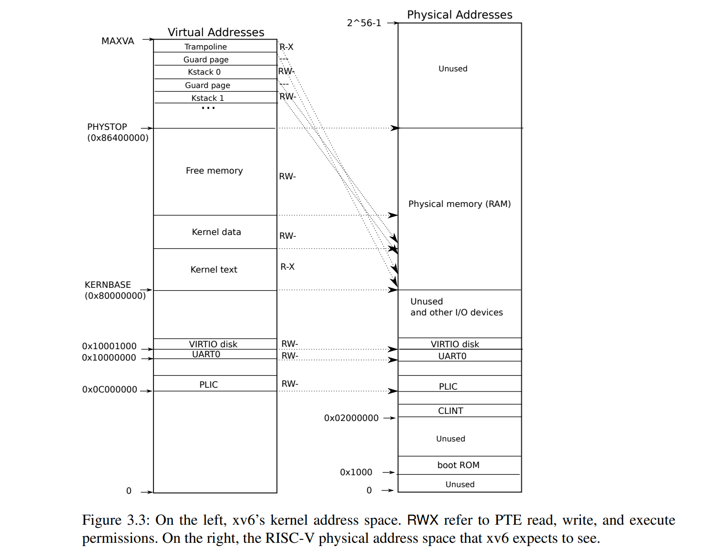
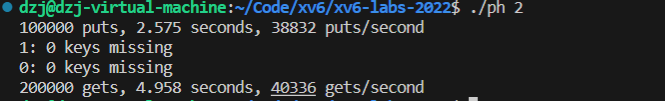

**PTE_V**：PTE是否有效
**PTE_R**：是否允许读取
**PTE_W**：是否允许写入操作
**PTE_X**：是否允许执行操作，如果设置为1，则允许执行页面的代码
**PTE_U**：是否允许用户态访问
**PTE_G**：表示全局页面
**PTE_A**：当一个页面被读取或写入时，硬件会将A标志位设为1
**PTE_D**：脏页，当一个页面被写入，硬件会将D标志设为1。

##Lab: Copy-on-Write Fork for xv6

&emsp;COW fork()（写时复制fork()）仅为子进程创建一个页表，其中包含指向父进程物理页面的用户内存页表项（PTE）。COW fork()将父进程和子进程中的所有用户PTE标记为只读。当任一进程尝试写入这些COW页面时，CPU会强制引发一个页面错误。内核的页面错误处理程序检测到此情况，为引发错误的进程分配一个物理内存页面，将原始页面复制到新页面中，并修改引发错误进程中相关的PTE，这次将PTE标记为可写。当页面错误处理程序返回时，用户进程将能够写入其页面的副本。<br>
&emsp;写时复制使得释放用户内存的物理页面变得复杂，因为一个页面可能有许多进程的页表所应用，只有当最后一个引用消失时，你才应该释放他

目标：**完成COW fork()**

&emsp;1.在kalloc.c文件中添加记录页面引用次数的数组，数组大小为PSYSTOPE/PGSIZE
```c
struct ref_stru {
  struct spinlock lock;
  int cnt[PHYSTOP / PGSIZE];  // 引用计数
} ref;
```
spinlock是一个锁，防止多个进程同时修改时出现错误
&emsp; 增加引用次数函数
```c
int add_refcnt(uint64 pa){
  if(pa >= PHYSTOP)
    return -1;
  acquire(&ref.lock);
  ++ref.cnt[pa/PGSIZE];
  release(&ref.lock);
  return 0;
}
```
&emsp;返回指定页面的引用个数
```c
int find_refcnt(uint64 pa){
    if(((uint64)pa % PGSIZE) != 0 || (char*)pa < end || (uint64)pa >= PHYSTOP)
   {
     return -1;
   }
   return ref.cnt[pa/PGSIZE];
}

```
&emsp;修改kinit，kfree，kalloc freerange函数
```c
void
kinit()
{
  initlock(&kmem.lock, "kmem");
  //初始化锁
  initlock(&ref.lock, "ref");
  freerange(end, (void*)PHYSTOP);
}

void
freerange(void *pa_start, void *pa_end)
{
  char *p;
  p = (char*)PGROUNDUP((uint64)pa_start);
  for(; p + PGSIZE <= (char*)pa_end; p += PGSIZE){
    //都默认初始化为1，否则可能在kfree函数中减为-1，
    ref.cnt[(uint64)p/PGSIZE] = 1;
    kfree(p);
  }
}

void
kfree(void *pa)
{
    //当引用计数为0时，释放页面
    acquire(&ref.lock);
    if(--ref.cnt[(uint64)pa / PGSIZE] == 0) {
    release(&ref.lock);

    r = (struct run*)pa;

    // Fill with junk to catch dangling refs.
    memset(pa, 1, PGSIZE);

    acquire(&kmem.lock);
    r->next = kmem.freelist;
    kmem.freelist = r;
    release(&kmem.lock);
  } else {
    release(&ref.lock);
  }

}

void *
kalloc(void){
    if(r){
    kmem.freelist = r->next;
    acquire(&ref.lock);
    ref.cnt[(uint64)r / PGSIZE] = 1;  // 将引用计数初始化为1
    release(&ref.lock);
  }
}
```

&emsp;2.修改uvmcopy()函数，将父进程的物理页面映射到子进程中，而不是分配新的页面。对于具有PTE_W标志的页面，清除子进程和父进程的PTE中的PTE_W标志。
```c
int
uvmcopy(pagetable_t old, pagetable_t new, uint64 sz)
{
  pte_t *pte;
  uint64 pa, i;
  uint flags;

  for(i = 0; i < sz; i += PGSIZE){
    if((pte = walk(old, i, 0)) == 0)
      panic("uvmcopy: pte should exist");
    if((*pte & PTE_V) == 0)
      panic("uvmcopy: page not present");
    //获得页表项的物理地址
    pa = PTE2PA(*pte);
    //如果页面是可写的，设置cow标志
    if(*pte & PTE_W){
      *pte = (*pte & (~PTE_W) )| PTE_COW;
    }    
    flags = PTE_FLAGS(*pte);

    //增加引用次数
    add_refcnt(pa);
    //创建子进程到父进程内存的映射
    if(mappages(new, i, PGSIZE, (uint64)pa,flags) != 0){
      goto err;
    }
    
  }
  return 0;

 err:
  uvmunmap(new, 0, i / PGSIZE, 1);
  return -1;
}
```
&emsp; 3.修改usertrap函数，处理page fault,


当**scause**寄存器的值15，也就是Store page fault时，说明发生页面写入异常，可以判断是否是COW异常
```c
if(r_scause() == 15){
      //判断是否是COW
      struct proc *p = myproc();
      //获取出错的虚拟地址
      uint64 vaddr = r_stval();
      vaddr = PGROUNDDOWN(vaddr);
      pte_t *pte = walk(p->pagetable,vaddr,0); 
      uint64 pa = PTE2PA(*pte);
      //判断是否是COW
      if(CowPage(vaddr,pte) == -1){
        goto end;
      }
      //引用计数为1，只需要修改PTE_W
      if (find_refcnt(pa) == 1){
        *pte |= PTE_W;
        *pte &= ~PTE_COW;
      }
      else{
        //引用计数大于1
        char *mem = kalloc();
        if(mem == 0)
          goto end;
        // 复制就页面内容到新页面
        *pte &= ~PTE_V;
        memmove(mem,(char *)pa,PGSIZE);
        uint64 flags = PTE_FLAGS(*pte);
        flags |= PTE_W;
        flags &= ~PTE_COW;
        if(mappages(p->pagetable,vaddr,PGSIZE,(uint64)mem,flags) != 0){
          kfree(mem);
          *pte |= PTE_V;
          goto end;
        } 
        kfree((char*)PGROUNDDOWN(pa)); 
      }
  }
```

&emsp;4.修改copyout函数
有些时候copyout也会访问COW页面，因此也需要判断是否是COW页面，并做对应的处理
```c
int
copyout(pagetable_t pagetable, uint64 dstva, char *src, uint64 len)
{
  uint64 n, va0, pa0;

  while(len > 0){
    va0 = PGROUNDDOWN(dstva);
    pte_t *pte = walk(pagetable,va0,0);
    uint64 pa = PTE2PA(*pte);
    if(CowPage(va0,walk(pagetable,va0,0)) == 0){
        if (find_refcnt(pa) == 1){
        *pte |= PTE_W;
        *pte &= ~PTE_COW;
      }
      else{
        //引用计数大于1
        char *mem = kalloc();
        if(mem == 0)
          panic("copyout");
        // 复制就页面内容到新页面
        *pte &= ~PTE_V;
        memmove(mem,(char *)pa,PGSIZE);
        uint64 flags = PTE_FLAGS(*pte);
        flags |= PTE_W;
        flags &= ~PTE_COW;
        if(mappages(pagetable,va0,PGSIZE,(uint64)mem,flags) != 0){
          kfree(mem);
          *pte |= PTE_V;
          panic("copyout");
        } 
        kfree((char*)PGROUNDDOWN(pa)); 
      }
    }
    pa0 = PTE2PA(*pte);
    ....
  }
}
```

## lab multithreading
lab target: **本实验将使你熟悉多线程的允许方式，并实现线程之间的切换，并利用多线程进行程序运行加速**

#### uthread:switching between threads
在 user space 中创建一个线程切换机制。

**背景知识** 
  caller saved register :函数调用时，被调用者不保存其中的数据，由调用者决定是否保存
  callee saved register :函数调用时，被调用者保存其中的数据

由于switch thread 是函数调用，因此在保存上下文时，只需要保存 callee saved registers

  1.首先在user/uthread.c中创建上下文结构体，用来保存callee saved registers
  ```c
  
  struct context {
  uint64 ra;
  uint64 sp;
  // callee-saved
  uint64 s0;
  uint64 s1;
  uint64 s2;
  uint64 s3;
  uint64 s4;
  uint64 s5;
  uint64 s6;
  uint64 s7;
  uint64 s8;
  uint64 s9;
  uint64 s10;
  uint64 s11;
};
  ``` 
thread_creat函数，创建一个thread
  ```c
  void 
thread_create(void (*func)())
{
  struct thread *t;

  for (t = all_thread; t < all_thread + MAX_THREAD; t++) {
    if (t->state == FREE) break;
  }
  t->state = RUNNABLE;
  // YOUR CODE HERE
  // 指向线程要运行的函数，switch后返回ra处
  t->context.ra = (uint64)func;
  // 保存线程的栈
  t->context.sp = (uint64)&t->stack[STACK_SIZE-1];

}
  ```

  
  ```c
  void 
thread_schedule(void)
{
  ...
  /* YOUR CODE HERE
     * Invoke thread_switch to switch from t to next_thread:
     * thread_switch(??, ??);
     */
    //交换线程
    thread_switch((uint64)&t->context,(uint64)&current_thread->context);
  ...
}
  ```
  thread_switch函数，直接粘的switch的code，保存上下文，a0寄存器是参数&t->context  a1寄存器是current_thread->context
  ```S
  thread_switch:
	/* YOUR CODE HERE */
	sd ra, 0(a0)
        sd sp, 8(a0)
        sd s0, 16(a0)
        sd s1, 24(a0)
        sd s2, 32(a0)
        sd s3, 40(a0)
        sd s4, 48(a0)
        sd s5, 56(a0)
        sd s6, 64(a0)
        sd s7, 72(a0)
        sd s8, 80(a0)
        sd s9, 88(a0)
        sd s10, 96(a0)
        sd s11, 104(a0)

        ld ra, 0(a1)
        ld sp, 8(a1)
        ld s0, 16(a1)
        ld s1, 24(a1)
        ld s2, 32(a1)
        ld s3, 40(a1)
        ld s4, 48(a1)
        ld s5, 56(a1)
        ld s6, 64(a1)
        ld s7, 72(a1)
        ld s8, 80(a1)
        ld s9, 88(a1)
        ld s10, 96(a1)
        ld s11, 104(a1)

	ret    /* return to ra */
  
  ```

  Using threads

  当使用单线程向哈希表插入数据时
  

  当使用多线程插入
  
  很明显虽然速度快了一倍，但有许多数据丢失的情况

  这是因为双线程有竞争，两个进程可能同时插入一个桶

  使用pthread(一个库)将共享区域锁住
  ```c
  static 
void put(int key, int value)
{
  int i = key % NBUCKET;

  // is the key already present?
  struct entry *e = 0;
  for (e = table[i]; e != 0; e = e->next) {
    if (e->key == key)
      break;
  }
  pthread_mutex_lock(&mutex);//加上互斥锁
  if(e){
    // update the existing key.
    e->value = value;
  } else {
    // the new is new.
    insert(key, value, &table[i], table[i]);
  }
  pthread_mutex_unlock(&mutex); // 解锁

}
  ```
运行结果


当然也可以使用桶锁，就是将每一个桶都建立一个锁，这样效率会更高，因为上面这种方法使得多线程程序串行化了

```
pthread_mutex_t lock[NBUCKET];//NBUCKET是桶的数量
```


